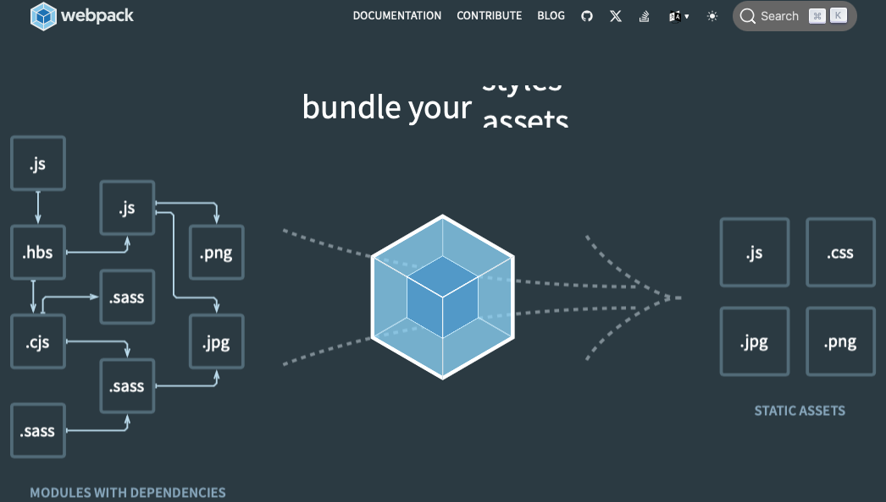

# 用語集_JavaScript

- Node.js
  - 公式サイトから抜粋すると『Chrome の V8 JavaScript エンジンで動作する JavaScript 環境』 .  
  従来、JavaScriptはブラウザに読み込ませることでしか実行できない言語であったが、Node.js を利用することでスクリプト言語のようにブラウザ以外でも実行が可能となった。

- ES5/ES6
  - ES5とES6は、ECMAScriptという規格のことを指す。ES6では、主に以下の機能拡張がされた。  
    - classの導入
    - imoprtやexportによるモジュール化の実現
    - letによるブロックスコープのサポート
    - PromiseやMapなどの組み込みオブジェクトの拡充
    - String、Arrayなど既存の重要な組み込みオブジェクトの拡充

- Underscore.js・Lodash.js
  - 「-.map」のような記述を提供するライブラリ。  
  _で始まる関数は、何らかのライブラリが提供しているものでJavaScriptの本来の機能でないということを覚えておくこと。

- falsyな値
  - JavaScriptは、以下の値をfalseとして判定する。以下の値以外はtrueと判定する。
    - false、null、undefined、0、NaN、''（空文字）

- オブジェクトとは
  - JavaScriptでのオブジェクトは、他言語のオブジェクトやインスタンスと言われるものとは異なる。  
  JavaScriptでのオブジェクトは、プロパティとメソッドの組み合わせで構成されるコンテナ。  
  そのため、JavaScriptではオブジェクトと連想配列の区別がない。

- 関数の定義方法
  - fucntion定義  
    `funcion sum(a, b) { return a  b; };`
  - 関数リテラル（＝匿名関数や無名関数）  
  ` let sum = funcion(a, b) { return a + b; }; `
  - アロー関数  
  ` let sum = (a, b) => { return a + b; }; `

- ２通りのプロパティアクセス
  - 点記法（オブジェクト.プロパティ名）
  - カンマ記法（オブジェクト['プロパティ名']）  
  カンマ記法は、以下の場合に使用する。
    - プロパティ名にハイフンやスペースが入っている場合
    - プロパティ名が予約語の場合
    - 変数の値をプロパティ名に使う場合

- オーバーロードは存在しない
  - ES6でclass定義が可能になったが、Javaのようにシグニチャ（引数や戻り値）の異なる同名メソッドの定義はできない。

- コンストラクタ関数
  - classが導入される以前は、以下のように記述してクラス定義に似たことを実現していた。

    ```javascript
    let Person = fucntion (name, age) {
        this.name = name;
        this.age = age;
        this.getName = function() {
            return this.name;
        }
    }
    ```

- new String()
  - String()コンストラクタにより文字列生成できるが、参照定義がリテラル宣言時と異なるため、使用は非推奨。  
  以下のように等価・同値とならない。

    ```javascript
    let str1 = new String('Hello');
    let str2 = 'Hello';
    str1 == str2 // false
    ```

- イミュータブル
  - 一言で言うと、不変。イミュータブルとは、オブジェクトの状態が変化しないことを示す。

- JavaScriptにcharは存在しない
  - JavaScriptの多くの規約では、文字列はシングルクォートでくくりなさいと書かれている。  
  そしてこのことは、JavaScriptにchar型は存在しないということを示している。

- 型変換のイディオム（定石）
  - JavaScriptで型変換する場合は、以下を覚える。

    ```javascript
    // 数値を文字列に
    let str = 123 + '';

    // 文字列を数値に
    let num = '123' - 0;

    // aがfalsyでないときaを代入。falsyのときbを代入
    let a = a || b;
    ```

- thisが指すもの
  - 様々なプログラミング言語のthisは、当事者となっているオブジェクトを指すことがほとんどだが、JavaScriptでは文脈で変化する。  
  - JavaScirptのthisは、トップレベルではグローバルオブジェクトを指す。  
  別にthisが関数内にある場合は、以下の通り。  
    1. コンストラクタの呼び出し→生成したオブジェクト

    ```javascript
    function MyClass(x, y) {
        this.x = x;
        this.y = y;
    }
    ```

    2. メソッド呼び出し→レシーバオブジェクト

    ```javascript
    obj = {
        name: 'たいち',
        age: 20,
        func: function() {
            return this.name;
        }
    };
    ```

    3. apply, call呼び出し→applyまたはcallの引数で指定したオブジェクト
    4. イベントリスナ→イベントの発生元

    ```javascript
    <input type="button" id="btn" value="ボタン"/>
    </body>
    <script>
        $("#btn").click(function() {
            window.alert(this.value)
        });
    </script>
    </html>
    ```

    5. それ以外の呼び出し→グローバルオブジェクト

- ==（等価演算子）と ===（同値演算子）

    ```javascript
    '23' == 23 // true
    '23' === 23 // false
    ```

- switch は === で判定

- Mapの登場
  - オブジェクトは、プロパティを格納するコンテナ。そのため、プロパティのキーには、文字列型しか使用できなかった。  
  ところが、ES6のMapは、あらゆる型のキーバリュー形式のデータを持つことができるようになった。

    ```javascript
    let pref = new Map();
    pref.set(Number(13), '東京都');

    console.log(pref.size);
    console.log(pref.keys());
    ```

- 名前空間としてのオブジェクト
  - フロント側のルーティング設定の例。

    ```javascript
    const HOME = '/user/home';
    const SIGN_IN = '/user/signin';

    const HOME = '/admin/home';
    const SIGN_IN = '/admin/sign_in';
    ```

    このままでは衝突するため、以下のように名前空間を利用する。

    ```javascript
    const USER = {
        HOME = '/user/home';
        SIGN_IN = '/user/signin';
    }
    
    const ADMIN = {
        HOME = '/admin/home';
        SIGN_IN = '/admin/sign_in';
    }
    ```

- 関数型プログラミング
  - 関数を第一級オブジェクトとして扱うプログラミングのこと。

    ```javascript
    /* forEach */
    [1, 2, 3, 4].forEach(
        function (value, index, array) {
            consolg.log(value * 2);
        }
    ); // 2, 4, 6, 8

    /* map */
    let result = [1, 2, 3, 4].map(
        function (value, index, array) {
            consolg.log(value * 2);
        }
    ); // [2, 4, 6, 8]

    /* fliter */
    let result = [1, 2, 3, 4].filter(
        function (value, index, array) {
            return value % 2 == 0;
        }
    ); // [2, 4]
    ```

- アロー関数
  - 関数リテラルと同じく、関数の定義を省略できる記法。
  
- コールバック関数
  - ある関数が特定のタスクを終えた後に実行される、別の関数のこと。  
    プログラミングでは、非同期処理、イベントリスナー、タイマー関数などで広く利用されている。

- コールバック関数の特徴と使い方
  - 非同期処理：例えばサーバからデータを取得する際に、データが全て取得された後で何かの処理を行いたい場合、その処理をコールバック関数として指定する。
  - イベントハンドリング：ユーザーからの入力やクリックなどのイベントに反応して特定の関数を実行する場合にもコールバックが使用される。  
    例えば、ボタンがクリックされたときに動作する関数をコールバックとして設定できます。
  - タイマー関数：一定時間後に処理を実行するsetTimeoutやsetIntervalなどのJavaScriptのタイマー関数も、実行する関数をコールバックとして指定する。

コード例（JavaScript）

```javascript
function processData(callback) {
    // 何かデータを処理する
    // 処理が終わった後にコールバック関数を呼び出す
    callback();
}

processData(function() {
    console.log("データ処理完了後に実行される");
});
```

この例では、processData関数は何かのデータ処理を行い、その処理が完了した後でコールバック関数を呼び出している。  
コールバック関数はデータ処理が完了したことをログに出力する。

コールバック関数の利用には注意も必要で、多用すると「コールバック地獄」と呼ばれる状況に陥りやすくなる。  
これは、コールバック関数が多重にネストされ、コードの可読性や管理が難しくなることを指します。  
この問題を解決するために、プロミスやasync/awaitなどのより新しい技術が導入されています。

- SPA
  シングルページアプリケーション。起動時に一度HTML全体をロードして、以後ユーザーインタラクションに応じてAjaxで情報取得し、動的にページを更新するWebアプリケーションを指す。  
  従来型（MPA）のHTML全体をページ遷移のたびに読み込む方法よりも、より高速なUI動作を実現できる。  
  サーバーは情報をレスポンスするだけで済み、ページレンダリング及び遷移をしなくていいため、オーバヘッドが軽減される。

- MVVM（Model, View, ViewModel）
  - Model・・・データを管理する
  - View・・・画面表示を管理する
  - ViewModel・・・データと画面表示の橋渡しをする

jQueryは、データの変更に応じてDOM操作するコードが必要だった。
MVVMでは、モデルからビューへのデータ連携、ビューからモデルへのデータの双方向バインディングをおこなうアーキテクチャのため、
DOM操作のコード不要でUIにデータの変更を反映させることができる。

- トランスパイル
  AltJs（TypeScript）からJavaScriptのように、言語から言語にコンパイルすること。

- ビルドツール
ビルドとは、ソースコード上で読み込んでいるモジュールの依存を解決し、実行可能なJavaScriptの形式に変換する仕組みのこと。

- タスクランナー
フロントエンド開発の環境が複雑化して、AltJSのトランスパイル、SCSSからCSSへの変換、画像圧縮、デプロイなど、多くのタスク実行が必要になった。そこで、ビルドのステップを管理し実行するためのタスクランナーであるGruntやgulpが一時期流行した。しかし、学習コストが高いためあまり使われなくなり、npmスクリプトによるコマンド実行を利用する方針で置き換えられていった。
2015年ごろからwebpackなどのビルドツールがフロントエンド開発環境を劇的に変化させた。コマンドラインでビルドを実行可能で、必要なパラメータやプラグインを任意で組み込める。
- フロントエンド開発でwebpackを活用することのメリット
  - 利用している依存モジュールのバージョン管理と解決を自動化できる
  - ファイル結合やコード圧縮などを自動化できる
  - プラグイン機構により様々なカスタマイズができる
  - ホットリロードなど開発の効率化ツールを同期できる


