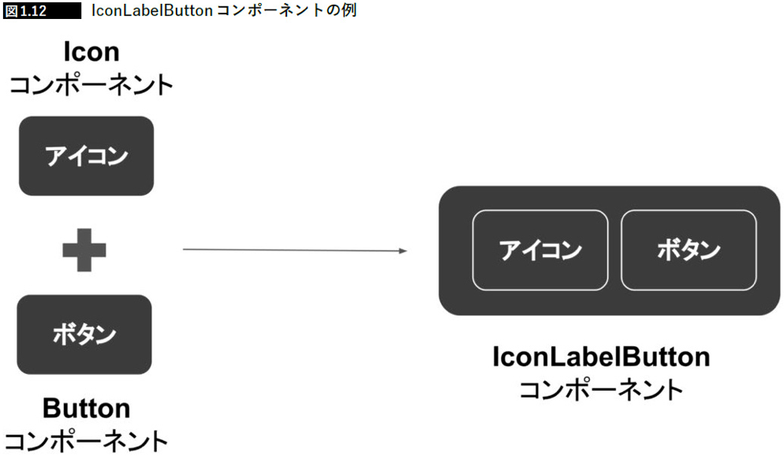
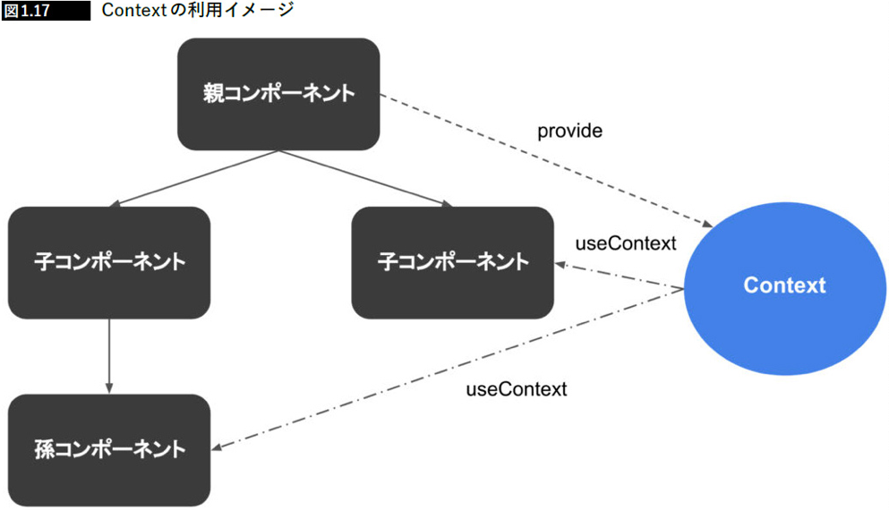

# TypeScript と React・Next.js でつくる実践Webアプリケーション開発

## 1章 Next.jsとTypeScriptによるモダン開発

### Next.jsとは

Reactベースのフレームワーク。
SSRや静的Webサイト生成、Webアプリ開発の便利機能を提供する。  
Reactベースではありながら、サーバー機能も一部持ち合わせている。

### Reactの特徴

- 仮装DOM
  - Reactの特に画期的であった点は仮想DOMとステート管理の設計。仮想DOMは直接ブラウザの持つDOMのAPIを操作するのではなく、ノードが変更された場合、変更前後の仮想DOMを比較して変更箇所を特定し、必要に応じてまとめて実際のDOMに変更を適用するという発想から生まれた技術。パフォーマンスを向上させられ、テストも容易になり、ブラウザの実装に依存しない形でDOMを組み立てられるため、後にサーバーサイドでのコンポーネントレンダリングなどに応用されることとなった。
- 宣言的UI
- 単一方向のデータの受け渡し
- コンポーネント指向・関数コンポーネント
- Fluxアーキテクチャとの親和性
  - Flux：データの流れを単一方向に限定したアーキテクチャ。現在はFluxを発展的に継承したライブラリ「Redux」が人気。

### SSR/SSG の必要性

SSR（Server Side Rendering）  
サーバーサイドJavaScript実行環境でリクエストに応じてページを生成しHTMLを返すこと。
Reactでは通常、ユーザーのブラウザがJavaScriptを実行し、JSONをもとにページを構築する。
対してSSRは、サーバー側でこれをおこない、HTMLを生成して返す。
Node.jsによりサーバーサイドでJavaScriptを実行できる環境が普及し、Reactなどの仮装DOMにより、サーバー側でUIコンポーネントをレンダリングしてフロントエンドに返す実装方法が注目されるようになった。

- SSR化のメリット
  - レンダリングをサーバーサイドでおこなった結果を返すため、サイト表示の高速化が可能
  - サーバーサイドでコンテンツを生成するため、SPAでは難しかったSEOを向上させることが可能
- SSR化のデメリット
  - Node.jsなどのサーバーサイドJavaScript実行環境が必要になる
  - サーバーサイドでレンダリングするためサーバーのCPU負荷が増える
  - サーバーとクライアントでJavaScriptのロジックが分散してしまう可能性がある

SSG（Static Site Generation）  
事前に静的ファイルとして生成し、デプロイする仕組み。SSRではサーバーへアクセスする度にHTMLを生成していたため、トラフィックが多い場合はサーバーの負荷について考えなければいけないが、SSGの概念によりこの弱点を補える。
例えば、ブログのようなサイトの場合、記事の詳細ページを事前にレンダリングした結果をサーバー上での処理なしに静的HTMLファイルとしてホスティングできる。それにより、より軽量で負荷に強いサービスの構築が可能になる。
ただし、例えばログインするユーザーによって表示を切り替える必要があるといった動的コンテンツを配信する必要がある場合は相性が悪く、利用に適したケースを判断して使い分ける必要がある。

### Next.js によるフロントエンド開発環境の管便化ポイント

Next.jsはReact機能に加え、SSRやSSGなどの機能を持つ。ReactではReact Router を使用し、SPAとしてレンダリングするのが主流だが、Next.jsではアプリの特性に合わせてページレンダリングをサーバー側でもおこなえるため、SEOやパフォーマンスの面で優位となる。

- Reactのフレームワーク
- SPA/SSR/SSGの切り替えが容易
- 簡単なページルーティング
- TypeScriptベース
- デプロイが簡単
- 学習コストが少ない
- webpackの設定の隠蔽
- ディレクトリベースの自動ルーティング機能
- コードの分割・統合

### コンポーネント指向

コンポーネントとは「再利用可能な部品」を表し、コンポーネント指向とは、コンポーネントの組み合わせによりUIを実現していく設計アプローチのこと。

- コンポーネント設計で得られるメリット
  - 部品の再利用が容易になる（疎結合になる）
  - グローバルを汚染しない
  - コードの可読性が上がる
  - テストが容易になる

良いコンポーネント設計の特徴は、できる限り抽象的に設計されていること。
サービスや機能固有のロジックを含めてUI部品を実装してしまうと再利用性が低くなり、コンポーネントとしての恩恵を得られなくなってしまうため、できるだけサービスや機能固有といったものを排除して再利用可能な形で実装することが大事。

例えば、FacebookやTwitterでログインできるよくあるソーシャル連携認証ボタンの実装。

このコンポーネントを実装する際に、FacebookButtonというコンポーネントとして作るのではなく、例えばIconLabelButtonといった将来他のソーシャル連携をサポートした際に再利用できる形が望ましい。1つの認証用ボタンをコンポーネントとして実装し、そのコンポーネントに対してアイコンとラベルの情報を外側から渡して実装するアプローチをすること。

コンポーネントが見た目の振る舞いを変更するためには、外部からそのコンポーネントに必要な値を受け入れる、もしくは、コンポーネント内の状態を変化させる。できる限りコンポーネントが利用するステートを別のコンポーネントに依存させない形で実現するのが重要。コンポーネントはつまり値を渡した際のUIへの変換器とも言える。コンポーネント指向で実装するということは、できる限り基礎的なコンポーネント部品を再利用可能な形でアプリケーションのコンテキストに依存させない形で実現することを意識することが大切。

### コンポーネントの状態管理

#### props

コンポーネントの外側から受け取ることのできる値。コンポーネントの中でトリガーされた時に呼び出される関数を渡すことも可能。

#### state

コンポーネント内部で保持するデータ。propsと異なりコンポーネントの外側から値を受け取ることはできず、外部からアクセスをしないもの。

propsは単一方向データフロー構造が特徴で、stateは値が変化した時に影響を与えるのはstateを持つコンポーネント自身かその配下のコンポーネント（再レンダリングなど）

#### Context

コンポーネント間のデータのやり取りをpropsを経由せずに行うためのアーキテクチャ。
例えば、ログインユーザー情報をヘッダーに表示したいなど。
Contextの利用方法は、以下。

1. 共有するためのデータを含むContextを作成
2. ProviderによりContextを適用するスコープを定める
3. データを利用するコンポーネント内でuseContextを呼び出す

### FluxのライブラリRedux

Fluxはアーキテクチャの名前で、ReduxはFluxアーキテクチャに影響を受けた実装（ライブラリ）の1つの名前である。Fluxライブラリは他にもあるが、Reduxはその中でも一番人気があるライブラリ。

#### Atomic Design とコンポーネントの粒度

UIはページ単位でなく機能とコンポーネントで捉えるべきというコンセプト。

- 定義の一例
  - Atoms  
    UIの最小単位。それ以上機能的に分割できないもの
  - Molecules  
    1つ以上のAtom（Atoms）を組み合わせて作られる要素。検索フォームなど
  - Organisms  
    1つ以上のMoleculesを組み合わてせて作られる要素。ヘッダーなど
  - Templates  
    Organismsを組み合わせて1つの画面として成り立つもの
  - Pages  
    Templateにアプリケーションとして動作するデータが注ぎ込まれたもの

#### Storybook

コンポーネントをカタログ化して管理できる開発ツール。

- Storybookを利用するメリット
  - コンポーネント設計を強制できる
  - コンポーネントのUIの確認を容易にできる
  - 開発者間での分業をしやすくなる
  - デザイナー、エンジニア間で共通認識が取れやすくなる
  - コンポーネントに渡す値を動的に変更し、振る舞いを確認できる
  - コンポーネントのユニットテスト・スナップショットテストが容易になる
  
## 2章 TypeScriptの基礎

## 3章 React/Next.jsの基礎

## 4章 コンポーネント開発

## 5章 アプリケーション開発1～設計・環境設定～

## 6章 アプリケーション開発2～実装～

## 7章 アプリケーション開発3～リリースと改善～

## Appendix

・決済ツール、UIスナップショットテストツール、レスポンシブ対応、国際化ツールなどの発展的な内容を解説。

## 参考

- TypeScript_【書籍】TypeScriptとReact・Next.jsでつくる実践Webアプリケーション開発
